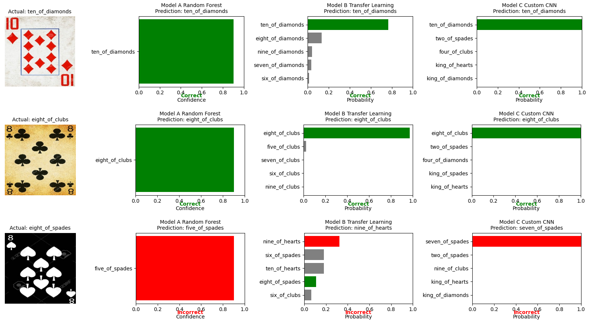

# Playing Card Image Classification 🃏

This project aims to build and evaluate various machine learning models to accurately classify playing cards from images. Given an image of a standard playing card, the model predicts its rank and suit (e.g., "ace of hearts," "king of spades").

### **Motivation**

Classifying objects in images is a classic computer vision challenge. Playing cards are an interesting subject because they can appear with a wide variety of variations, including:
* **Different orientations and angles**
* **Varying lighting conditions**
* **Partial occlusion (being covered up)**
* **Cluttered and noisy backgrounds**

This project has practical applications in areas like automated gaming, casino surveillance, and other systems that need to recognize structured objects.

### Results



---

## Dataset

The project utilizes the [**Cards Image Dataset-Classification**](https://www.kaggle.com/datasets/gpiosenka/cards-image-datasetclassification) from Kaggle.

The dataset is structured as follows:
* **Training Set**: 7,624 images
* **Validation Set**: 265 images
* **Test Set**: 265 images
* **Total Classes**: 53 (including one for 'joker')
* **Image Specs**: 224x224 pixels with 3 RGB color channels.

---

## Methodology

The project follows a structured approach from data preparation to model evaluation.

### **1. Preprocessing**
* File paths were loaded using Python's `pathlib`.
* Folder names were standardized by replacing spaces with underscores (e.g., "ace of spades" → "ace\_of\_spades") for easier access.
* The **"joker"** class was removed to focus on a standard 52-card deck.
* The image file paths and their corresponding labels were organized into pandas DataFrames.

### **2. Exploratory Data Analysis (EDA)**
* The dataset split was analyzed, revealing a **94% / 3% / 3%** distribution for training, validation, and testing sets, respectively.
* The distribution of images across all 52 classes was examined.
* Sample images for each rank (Ace, King, etc.) and suit (Hearts, Spades, etc.) were visualized to inspect the data quality and variations.

### **3. Feature Extraction & Clustering**
To manage the computational load of ~8,000 high-resolution images, we first extracted meaningful features using a pre-trained **ResNet50** model.

* **PCA + K-Means**: We applied Principal Component Analysis (PCA) to reduce the dimensionality of the extracted features and then used K-Means to see if the cards would cluster naturally.
    * **k=13 (Ranks)**: Clustering by the 13 card ranks (Ace-King).
    * **k=4 (Suits)**: Clustering by the 4 suits.
* **Silhouette Score**: This metric was used to evaluate the quality of the clusters. The scores were low (**0.0576 for ranks** and **0.0952 for suits**), indicating significant overlap between clusters, although suits were slightly more distinct than ranks.

### **4. Supervised Learning Models**
Three different supervised learning models were trained and evaluated.

* **Model A: Random Forest Classifier**
    * A traditional machine learning model trained on the features extracted by ResNet50.
    * Served as a quick-to-train baseline for performance.

* **Model B: Transfer Learning with ResNet50**
    * This deep learning model used the pre-trained ResNet50 architecture and fine-tuned it on our card dataset.
    * The base convolutional layers were frozen, and custom classification layers were added on top.

* **Model C: Custom Convolutional Neural Network (CNN)**
    * A deep learning model built from scratch with three convolutional layers followed by dense layers.
    * This model learned features directly from the images without relying on pre-trained weights.

---

## Results

The performance of the three models was compared based on their accuracy on the test set.

| Model | Test Accuracy |
| :--- | :---: |
| Model A: Random Forest | **~48%** |
| Model B: Transfer Learning | **56.2%** |
| Model C: Custom CNN | **~80%** |

The **Custom CNN (Model C) significantly outperformed** the other two models, demonstrating its ability to learn specialized features for this specific task. The Random Forest model served as a good baseline, while the Transfer Learning approach offered a notable improvement with minimal fine-tuning.

Analysis of the confusion matrices showed that all models struggled most with correctly distinguishing between face cards, particularly **Jacks and Kings**.

---

## Conclusion & Limitations

### **Conclusion**
Our Custom CNN architecture proved to be the most effective solution for this classification task, achieving nearly **80% accuracy**. This highlights the power of custom-built deep learning models for specialized computer vision problems.

### **Limitations**
* **Computational Resources**: Training the deep learning models was time-consuming and required significant computational power.
* **Image Quality**: The dataset contained some blurry or poorly lit images, which may have hindered model performance.
* **Generalization**: The models may struggle to classify cards with unusual designs, heavy wear-and-tear, or in environments with extreme lighting or clutter.

---

## How to Run

1.  **Clone the repository:**
    ```bash
    git clone https://github.com/spabolu/kaggle-playing-cards-img-classification.git
    cd kaggle-playing-cards-img-classification
    ```

2.  **Install dependencies:**
    ```bash
    pip install -r requirements.txt
    ```

3.  **Run the Jupyter Notebook:**
    ```bash
    jupyter notebook Project2.ipynb
    ```

---

## Dependencies
* `pandas`
* `numpy`
* `matplotlib`
* `seaborn`
* `scikit-learn`
* `tensorflow`
* `Pillow`
* `pathlib`
* `kagglehub`
